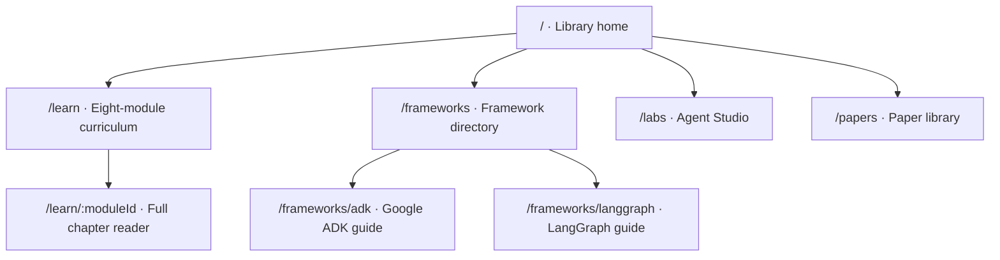

<p align="center">
  
</p>

<h1 align="center">Agent Atlas</h1>

<p align="center">
  A calm, source-linked learning library for going from first principles<br />
  to modern agentic-AI practice.
</p>

<p align="center">
  <a href="#choose-a-path">Choose a path</a> ·
  <a href="#library-map">Library map</a> ·
  <a href="#run-it-locally">Run locally</a> ·
  <a href="#source-policy">Source policy</a>
</p>

<p align="center">
  
  
  
  
</p>

---

Agent Atlas is not a dashboard of links. It is a paced learning experience: a beginner-friendly curriculum, readable full chapters, practical labs, and a paper library that keeps claims connected to their sources.

## At a glance

| Learn | Practice | Explore |
| --- | --- | --- |
| **8** curriculum modules | **6** build labs | **46** source-linked paper entries |
| **24** full chapter lessons | **2** framework guides (ADK · LangGraph) | **5** curated reading routes |

The path moves from foundations through perception, reasoning, tools, memory, multi-agent systems, and evaluation—then into frontier practice. Google ADK and LangGraph each have a dedicated guide rather than sitting in a generic resources list.

## Choose a path

<details open>
<summary><strong>I am new to agents</strong> — start with mental models, then build confidence one layer at a time.</summary>

1. Open **Foundations** in the running app at `/learn`.
2. Read the first full chapter at `/learn/foundations`.
3. Continue through perception, reasoning, tools, and memory before adding orchestration.
4. Use Agent Studio at `/labs` to turn each concept into a small, inspectable build.

</details>

<details>
<summary><strong>I build agents already</strong> — focus on systems design, frameworks, and reliability.</summary>

1. Jump to `/frameworks` and choose the Google ADK or LangGraph guide.
2. Use `/labs` to practice tool boundaries, approval flows, traces, and evals.
3. Read `/learn/evaluation` before introducing more autonomy or more agents.
4. Use `/papers` to follow a topic through its primary literature.

</details>

<details>
<summary><strong>I am researching the field</strong> — use the library as a navigable map of the literature.</summary>

1. Begin at `/papers`, then filter by theme or follow one of the five reading routes.
2. Open each primary source from the card instead of treating the summary as a substitute for the paper.
3. Cross-reference papers with the matching curriculum module and implementation lab.
4. Check [FACT_CHECK.md](./FACT_CHECK.md) for the coverage ledger and sourcing method.

</details>

## Library map



| Route | What it is for | Best moment to use it |
| --- | --- | --- |
| `/` | Gentle overview of the learning system | Deciding where to begin |
| `/learn` | Complete eight-module curriculum | Progressing through the subject in order |
| `/learn/:moduleId` | Focused full-chapter reader | Deep reading with fewer distractions |
| `/frameworks` | Implementation-oriented framework directory | Selecting or comparing frameworks |
| `/frameworks/adk` | Google ADK guide | Designing with Google ADK |
| `/frameworks/langgraph` | LangGraph guide | Graph state, control flow, durable execution |
| `/labs` | Agent Studio exercises and build checkpoints | Making a concept concrete |
| `/papers` | Searchable literature library and reading routes | Primary sources and research context |

### Curriculum modules

| # | Module | Focus |
| --- | --- | --- |
| 01 | Foundations | What makes a system an agent |
| 02 | Perception & context | Evidence, retrieval, and context budgets |
| 03 | Reasoning & planning | Controlled loops, plans, and re-plan triggers |
| 04 | Tools & actions | Typed tools, permissions, and failure modes |
| 05 | Memory & retrieval | State, provenance, and persistence |
| 06 | Multi-agent systems | Roles, handoffs, and simpler baselines |
| 07 | Evaluation & reliability | Cases, traces, and regression tests |
| 08 | Frontier practice | Benchmarks, transfer, and honest claims |

## What makes this library different

- **Reading first.** Full lessons use calm typography, checkpoints, and build prompts—not only cards or slide-like summaries.
- **Practice stays close to theory.** Each module connects to a tangible exercise so planning, tools, memory, evaluation, and orchestration become design skills.
- **Framework material is explicit.** Google ADK and LangGraph guides explain concepts, patterns, and trade-offs in their own destinations.
- **Sources stay visible.** Paper cards link to primary research or official issuer material; the coverage ledger records provenance.
- **The route is intentional.** Sequential study, targeted reference reading, and literature-led exploration without forcing one pace on every learner.

## Run it locally

**Requirements:** Node.js 18+ and npm.

```bash
npm install
npm run dev
```

Vite prints the local URL. Open it in a browser and use the navigation to move between routes.

| Script | Purpose |
| --- | --- |
| `npm run dev` | Start the development server |
| `npm run build` | Production build to `dist/` |
| `npm run preview` | Serve the production build locally |

## Project structure

```text
.
├── public/assets/     # Hero and lesson imagery
├── src/
│   ├── App.jsx        # Multipage routing and UI shells
│   ├── content.js     # Curriculum, chapters, labs, papers, guides
│   ├── main.jsx       # React entry
│   └── styles.css     # Editorial design system
├── qa/                # Design and content audit screenshots
├── FACT_CHECK.md      # Coverage ledger and sourcing notes
├── AGENTS.md          # Prototype conventions for agents
└── package.json
```

## Source policy

Agent Atlas prefers primary sources: papers, official framework docs, and issuer material over secondary blog summaries.

- Claims in curriculum chapters cite a concrete source when they make a factual assertion.
- Paper cards are starting points for reading—not substitutes for the original work.
- [FACT_CHECK.md](./FACT_CHECK.md) tracks coverage, gaps, and the review method.
- Content review date in the app: **22 Jul 2026**.

## Contributing

Small, well-sourced improvements are welcome—especially corrections, missing seminal work, clearer explanations, and new build exercises. Keep the reading experience calm, avoid turning the curriculum into a link dump, and include source context with any factual addition.

---

<p align="center">
  <sub>Built to make the path from “what is an agent?” to “how do I evaluate one responsibly?” feel legible.</sub>
</p>
