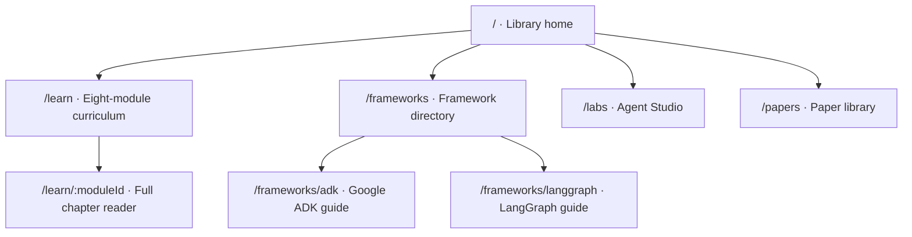

<p align="center">
  
</p>

<h1 align="center">Agent Atlas</h1>

<p align="center">
  A calm, source-linked learning library for going from first principles to modern agentic-AI practice.
</p>

<p align="center">
  <a href="#choose-a-path">Choose a path</a> ·
  <a href="#library-map">Explore the library</a> ·
  <a href="#run-it-locally">Run locally</a> ·
  <a href="#source-policy">See the source policy</a>
</p>

<p align="center">
  
  
  
</p>

Agent Atlas is not a dashboard full of links. It is a paced learning experience: a beginner-friendly curriculum, readable full chapters, practical labs, and a paper library that keeps claims connected to their sources.

## At a glance

| Learn | Practice | Explore |
| --- | --- | --- |
| **8** curriculum modules | **6** build labs | **46** source-linked paper entries |
| **24** full chapter lessons | **2** in-depth framework guides | **5** curated reading routes |

The experience deliberately moves from foundations through planning, tools, memory, multi-agent systems, and evaluation—then into frontier practice. Google ADK and LangGraph each have a dedicated guide rather than being buried in a generic resources list.

## Choose a path

<details open>
<summary><strong>I am new to agents</strong> — start with mental models, then build confidence one layer at a time.</summary>

1. Open [Foundations](./src/content/learning.js) in the running app at `/learn`.
2. Read the first full chapter at `/learn/foundations`.
3. Continue through perception, reasoning, tools, and memory before adding orchestration.
4. Use Agent Studio at `/labs` to turn each concept into a small, inspectable build.

</details>

<details>
<summary><strong>I build agents already</strong> — focus on systems design, frameworks, and reliability.</summary>

1. Jump to `/frameworks` and choose the [Google ADK](./src/content/frameworks.js) or [LangGraph](./src/content/frameworks.js) guide.
2. Use `/labs` to practice tool boundaries, approval flows, traces, and evals.
3. Read `/learn/evaluation-reliability` before introducing more autonomy or more agents.
4. Use `/papers` to follow a topic through its primary literature.

</details>

<details>
<summary><strong>I am researching the field</strong> — use the library as a navigable map of the literature.</summary>

1. Begin at `/papers`, then filter by theme or follow one of the five reading routes.
2. Open each primary source from the card instead of treating the summary as a substitute for the paper.
3. Cross-reference papers with the matching curriculum module and implementation lab.
4. Check [FACT_CHECK.md](./FACT_CHECK.md) for the coverage ledger and sourcing method.

</details>

## Library map



| Route | What it is for | Best moment to use it |
| --- | --- | --- |
| `/` | A gentle orienting overview of the learning system. | You want to decide where to begin. |
| `/learn` | The complete eight-module curriculum. | You are progressing through the subject in order. |
| `/learn/:moduleId` | A focused reader with the full learning content. | You want fewer distractions and more reading room. |
| `/frameworks` | A directory for implementation-oriented framework material. | You are selecting a framework or comparing patterns. |
| `/frameworks/adk` | A dedicated Google ADK guide. | You want to design with Google ADK. |
| `/frameworks/langgraph` | A dedicated LangGraph guide. | You need graph-based state, control flow, or durable execution patterns. |
| `/labs` | Agent Studio exercises and build checkpoints. | You are ready to make a concept concrete. |
| `/papers` | A searchable, filterable literature library and reading routes. | You want context behind an idea or a primary source. |

## What makes this library different

- **Reading first.** Full lessons are written as lessons, with calm typography, checkpoints, and build prompts—not only cards or slide-like summaries.
- **Practice stays close to theory.** Each module connects to a tangible exercise so that planning, tools, memory, evaluation, and orchestration become design skills.
- **Framework material is explicit.** The Google ADK and LangGraph guides explain concepts, patterns, and trade-offs in their own destinations.
- **Sources stay visible.** Paper cards link to primary research or official issuer material, while the coverage ledger records the provenance approach.
- **The route is intentional.** The app supports sequential study, targeted reference reading, and literature-led exploration without forcing every learner into the same pace.

## Run it locally

<details open>
<summary><strong>Development server</strong></summary>

```bash
cd agent-atlas
npm install
npm run dev
```

Vite will print the local URL. Visit it in a browser and use the navigation to move between the multipage routes.

</details>

<details>
<summary><strong>Production check</strong></summary>

```bash
cd agent-atlas
npm run build
npm run preview
```

`npm run build` produces the production bundle in `dist/`. `npm run preview` serves that bundle locally.

</details>

## Project layout

```text
agent-atlas/
├── public/assets/       # visual assets used by the learning experience
├── src/content/         # curriculum, framework, lab, and paper-library data
├── src/App.jsx          # route selection and page composition
├── src/styles.css       # responsive visual system and reader accessibility
├── FACT_CHECK.md        # content coverage and source-policy ledger
└── package.json         # Vite scripts and dependencies
```

## Source policy

The application distinguishes teaching material from source claims. The paper library points to primary papers where possible and official issuer pages where a canonical primary paper is not the appropriate source. The source-selection method, coverage counts, and factual-review notes live in [FACT_CHECK.md](./FACT_CHECK.md).

If you extend the library, keep the same standard:

1. Prefer a primary paper, official documentation, or another authoritative publisher page.
2. Link the claim or summary back to the relevant source.
3. Mark a claim as contextual framing when it is an interpretation rather than a directly stated result.
4. Run a production build before opening a pull request.

## Contributing

Small, well-sourced improvements are welcome—especially corrections, missing seminal work, clearer explanations, and new build exercises. Keep the reading experience calm, avoid turning the curriculum into a link dump, and include source context with any factual addition.

---

<p align="center">
  <sub>Built to make the path from “what is an agent?” to “how do I evaluate one responsibly?” feel legible.</sub>
</p>
